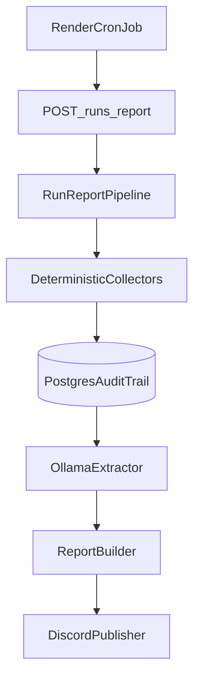

# Architecture Overview

## Purpose

This service gathers public market signals about the Indian pre-workout category, extracts structured insights with a self-hosted model, records the full audit trail, and optionally publishes the final digest to Discord.

## Request Flow

## Design Rules

- Collect first, infer second.
- Persist raw observations before model extraction.
- Keep orchestration in one place: `src/pipeline/run-report.ts`.
- Keep adapters thin: collectors, database, Ollama, Discord.
- Keep business contracts typed in `src/domain/contracts.ts`.

## Main Modules

- `src/config`: deployment and brand-specific settings.
- `src/collectors`: source-specific ingestion logic.
- `src/db`: schema and audit persistence.
- `src/llm`: structured extraction through Ollama.
- `src/reporting`: ranking and Discord formatting.
- `src/routes`: HTTP control surface.

## Extension Points

- Add new source types by creating another collector and switching on `SourceKind`.
- Add analyst approval by storing a report status before Discord publish.
- Add richer scoring by incorporating historical report frequency and source trust weights.
